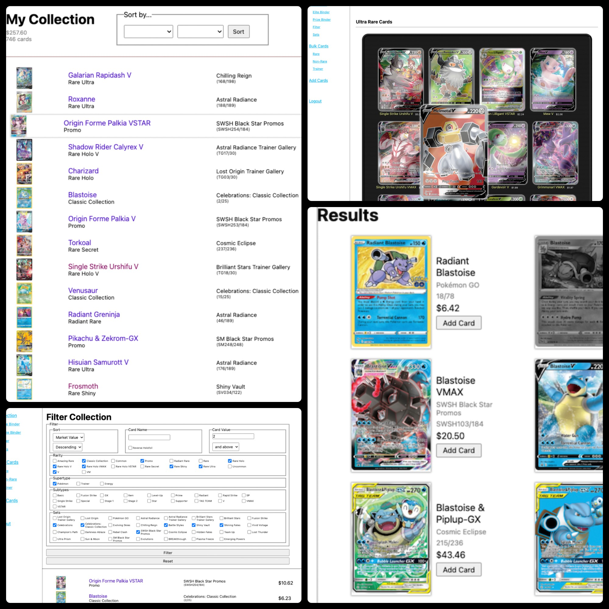

# Card Collector

- Live Site URL: [Card Collector](https://card-collector.onrender.com)

## Summary:

- Register to begin your collection
- ADD CARDS to your collection by searching from a deep database of all pokémon cards from base set to current
- View individual cards -- name, set, rarity, market value
- Update the current market value of the card from the detail screen, as well as viewing the value history as you create it

- Once a card is added to your collection:
  - you can view the individual card's information by clicking on it
  - You can FILTER through your collection with a variety of options
  - You can view your collection neatly organized by SETS - by year
  - You can add cards to your special cards to a PRIZE binder, and your extremely special cards to the ELITE
  - Add repeats to your BULK CARDS

## Table of contents

- [Overview](#overview)
  - [The challenge](#the-challenge)
  - [Screenshot](#screenshot)
- [My process](#my-process)
  - [Built with](#built-with)
  - [What I learned](#what-i-learned)
  - [Continued development](#continued-development)
  - [Useful resources](#useful-resources)
- [Author](#author)
- [Acknowledgments](#acknowledgments)

## Overview

### The challenge

Users should be able to:

- Log in to retain unique card collection data
- Search the TCGPlayer database for Pokémon cards
- Add cards to user's personal collection
- View entirety of card collection
- Sort card collection by set/year, rarity, price, name
- Filter personal collection by name, set, price, rarity
- View individual card information including image, set, price, and rarity
- Update in realtime market price value from tcgplayer
- Add cards to separate binders: prize and elite
- Add cards to bulk collection

### Screenshot

## My process

### Built with

- Flexbox
- [JavaScript](https://www.javascript.com/) - Frontend scripting language
- [Node.js](https://nodejs.dev/en/) - Backend JavaScript runtime environment
- [Express](https://expressjs.com/) - Web framework for Node.js
- [MongoDB](https://www.mongodb.com/) - NoSQL cloud database
- [Mongoose](https://mongoosejs.com/) - MongoDB object modeling for Node.js
- [Passport](https://www.passportjs.org/) - Authorization and session security

### Continued Development

## Author

- Website - [Jesse Putnam](https://jessejputnam.com)
